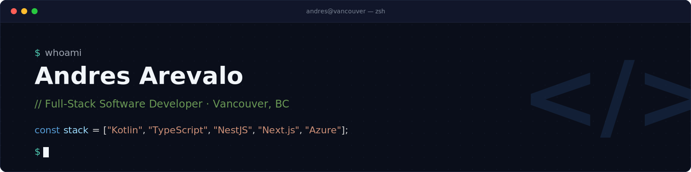

  

<h1 align="center">Hi there 👋, I'm Andres Arevalo</h1>
<h3 align="center">Full-Stack Software Developer based in Vancouver</h3>

    
  

---

### 👨‍💻 About Me

I'm a full-stack software engineer with 2+ years of production experience shipping features end-to-end across backend, API, and mobile layers. At Himigo, I work across Kotlin, Java, TypeScript, NestJS, and Next.js, designing scalable microservices, event-driven architectures, and multi-tenant systems on Azure. My background started in Android development, building offline-first apps with Jetpack Compose, MVVM, and Room, and I've since expanded into backend and web development, owning features from database design through deployment. I'm comfortable across the stack, and I actively integrate AI tools like Claude Code and Cursor to accelerate delivery while keeping code quality high.

---

### 🛠️ My Tech Stack

#### Languages

  
  
  
  
  

#### Backend & APIs

  
  
  
  

#### Mobile & Frontend

  
  
  
  
  

#### Databases & Cloud

  
  
  
  
  
  
  
  

---

### 🚀 Featured Projects

#### [1. Sequoia Staff Screen](https://github.com/andresfelipear/Sequoia-employees-info-web)
- **Description:** A full-stack, multi-tenant employee content management platform letting managers across 4+ restaurant locations create and deliver recognition posts, announcements, and operational content to in-venue digital displays.
- **Tech Stack:** TypeScript, NestJS, Next.js, PostgreSQL, Prisma, Supabase, JWT, Docker, Tailwind.
- **Achievement:** Built role-based access control with JWT refresh rotation and Argon2 hashing, plus a real-time TV player module; validated with 170+ unit tests.
- **API repo:** [Sequoia-employees-info-api](https://github.com/andresfelipear/Sequoia-employees-info-api)

#### [2. Tasky](https://github.com/andresfelipear/Compose-TaskyApp)
- **Description:** A production-ready, offline-first Android agenda app with full CRUD for tasks, events, and reminders.
- **Tech Stack:** Kotlin, Jetpack Compose, MVVM, Room, WorkManager, Hilt, Coroutines, Flows.
- **Achievement:** Achieved 85%+ code coverage through unit, integration, and UI testing, and cut refactor effort for new features by ~30% via clean separation of concerns.

#### [3. Holidays Calendar](https://github.com/andresfelipear/Compose-HolidaysApp)
- **Description:** A published Android app covering holidays for 50+ countries using a dual-API strategy.
- **Tech Stack:** Kotlin, Jetpack Compose, MVVM, Room, Retrofit, Material Design 3.
- **Achievement:** Improved performance by 15% through intelligent local caching, eliminating redundant API calls for static data.

### 📊 My GitHub Stats

  
  

